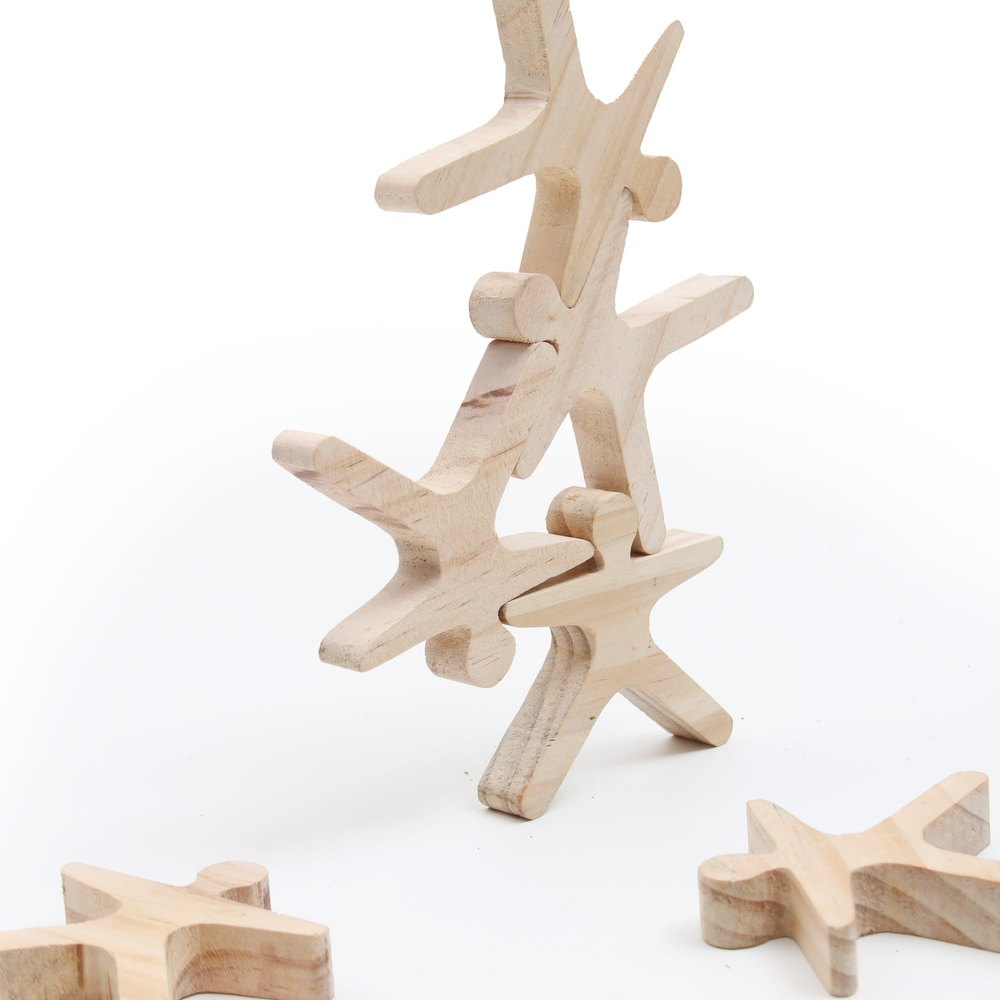
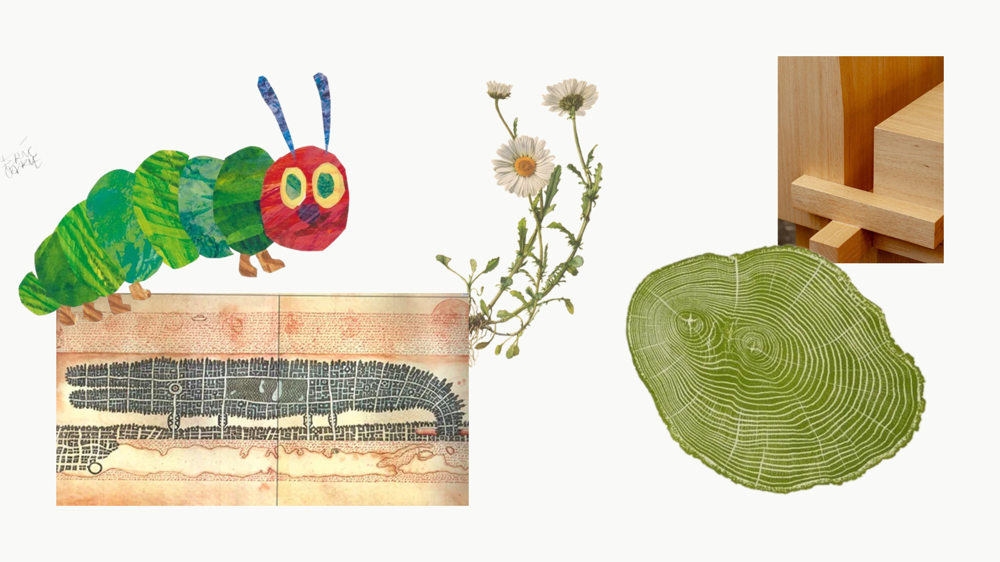

# Contexto de Design

## 1. Resumo / Abstract

### Resumo (PT)

A proposta **Nestor** desafiou-nos a trabalhar obrigatoriamente com a madeira, uma exigência que o nosso grupo decidiu levar como uma oportunidade para compreender e aplicar os ciclos da própria natureza. No mundo natural, o conceito de lixo não existe, tudo o que se desgasta transforma-se em base para algo novo, funcionando num ecossistema perfeitamente cíclico e auto-sustentável. O conceito do nosso projeto baseia-se exatamente nesta analogia. Quisemos que o ciclo de vida e a própria lógica de construção dos objetos espelhassem essa capacidade de regeneração, transformando a obrigação de usar um material natural no ponto de partida ideal para o design biofílico. 

Para honrar este ciclo e responder à urgência da sustentabilidade, deixámos que a natureza funcionasse como a própria designer do projeto. Em vez de forçarmos formas artificiais, estudámos formas e geometrias que o meio ambiente já desenvolve espontaneamente. 
Toda a coleção foi planeada para celebrar a madeira na sua essência mais pura, apostando exclusivamente em sistemas de encaixe funcionais e construções limpas. 

Do ponto de vista pedagógico, este foco na natureza afasta o projeto dos estímulos virtuais e artificiais que inundam o quotidiano atual, promovendo um retorno ao brincar tátil e livre. Ao interagir com as texturas reais da madeira e com formas que desafiam a gravidade, o peso, o equilíbrio e o cérebro, a criança descobre os princípios físicos que regem o nosso mundo de forma mais intuitiva. No fundo, o nosso conceito une a responsabilidade ecológica exigida pela proposta Nestor à sensibilidade da biofilia, mostrando que o design ganha uma importância muito maior quando passa a ouvir e valorizar a harmonia que a natureza nos oferece. 

### Abstract (EN)

The **Nestor** proposal challenged us to work exclusively with wood, a requirement that our group decided to view as an opportunity to understand and apply the cycles of nature itself. In the natural world, the concept of waste does not exist; everything that wears out becomes the basis for something new, functioning within a perfectly cyclical and self-sustaining ecosystem. The concept behind our project is based precisely on this analogy. We wanted the life cycle and very logic of the objects’ construction to mirror this capacity for regeneration, transforming the requirement to use a natural material into the ideal starting point for biophilic design. 
  
To honor this cycle and respond to the urgent need for sustainability, we let nature act as the project’s designer. Rather than imposing artificial forms, we studied the shapes and geometries that the environment already develops spontaneously. 
The entire collection was designed to celebrate wood in its purest form, relying exclusively on functional interlocking systems and clean constructions. 
 
From an educational perspective, this focus on nature distances the project from the virtual and artificial stimuli that flood our daily lives, promoting a return to tactile and free play. By interacting with the real textures of wood and with shapes that challenge gravity, weight, balance and the brain, children discover the physical principles that govern our world in a more intuitive way. Ultimately, our concept combines the ecological responsibility demanded by the Nestor proposal with a sensitivity to biophilia, demonstrating that design takes on far greater significance when it begins to listen to and value the harmony that nature offers us. 

## 2. Referências Coletivas

### 2.1. Recolha de Objetos a Redesenhar/Remisturar

- **Objeto 1** — AcroBots - OPA Toys, India. O objeto foi escolhido para um redesenho devido à sua vertente forte de "brincadeira", é um brinquedo que mostra trabalhar o cérebro e ao mesmo tempo ser prazeroso e divertido. Tem um desenho simples que pode ser facilmente alterado. 

- **Objeto 2** — ...

### 2.2. Moodboard

