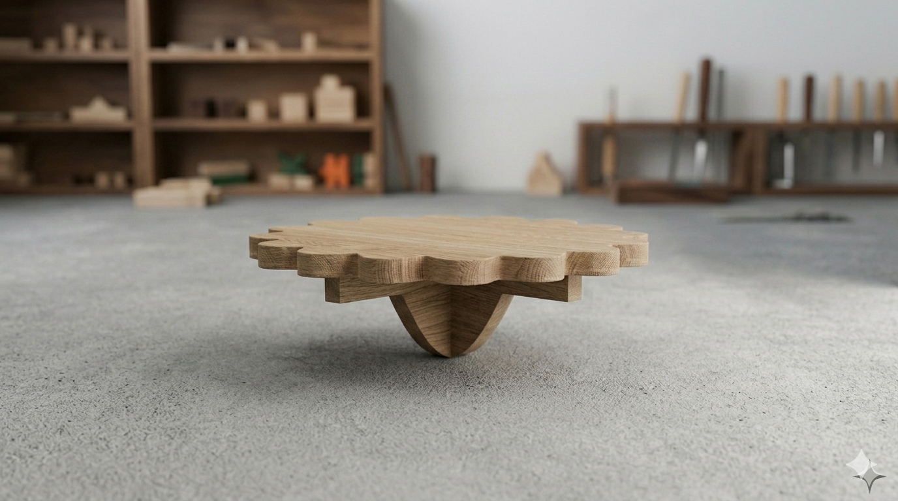
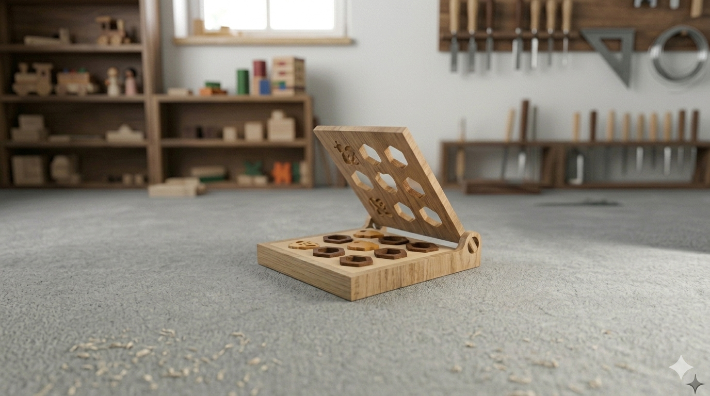
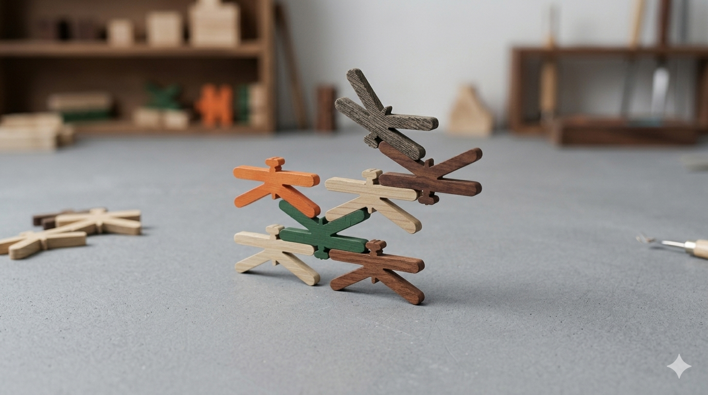

# Brincar é Natural

> Um ecossistema de brincadeira Eco-lógico inspirado pela Natureza e pensado para todos. 
## Elementos do Grupo

| Número  | Nome             |
| ------- | ---------------- |
| 2024268 | Karina Aguilar   |
| 2024572 | Sebastião Abreu  |
| 2024301 | Mariana Rocha    |
| 2024299 | Adrielly Saraiva |

---

## Contexto de Design

> Nesta zona pretenderão mostrar o que relaciona estes produtos que apresentam na galeria - a temática, conceito comum, objectivos comuns, brincadeiras (funções) comuns, entre outros...

(devem colocar imagens no corpo a qq momento, bastará que as arrastem para aqui.)

Resumo, referências coletivas e moodboard do grupo encontram-se em [contexto.md](contexto.md).

[Ver contexto completo →](contexto.md)

---

## Galeria de Produtos

<!-- Cada thumbnail liga à página individual de cada produto.
     Cada produto vive em produtos/<numero>-<nome>/index.md
     e tem uma sub-página produtos/<numero>-<nome>/processo.md -->

<!-- markdownlint-disable MD033 --> 

  <!-- duplicar o bloco abaixo para cada produto do grupo -->

  
<a class="gallery-card" href="produtos/2024572_sebastião_abreu/index.md">
    
    <h3>Quil</h3>
    
Sebastião Abreu

  </a>
  <a class="gallery-card" href="produtos/_modelo/">
    
    <h3>Nome do Produto</h3>
    
Mariana Rocha

  </a>
  <a class="gallery-card" href="produtos/2024299_adrielly_saraiva/index.md/">
    
    <h3>BeeZzy</h3>
    
Adrielly Silva

  </a>
    <a class="gallery-card" href="produtos/2024268_karina_aguilar/index.md">
    
    <h3>Libi</h3>
    
Karina Aguilar

  </a>
 

  <!-- duplicar o bloco acima para cada produto do grupo  e substituir _modelo em ambas por <numero>-<nome> -->

<!-- markdownlint-enable MD033 -->