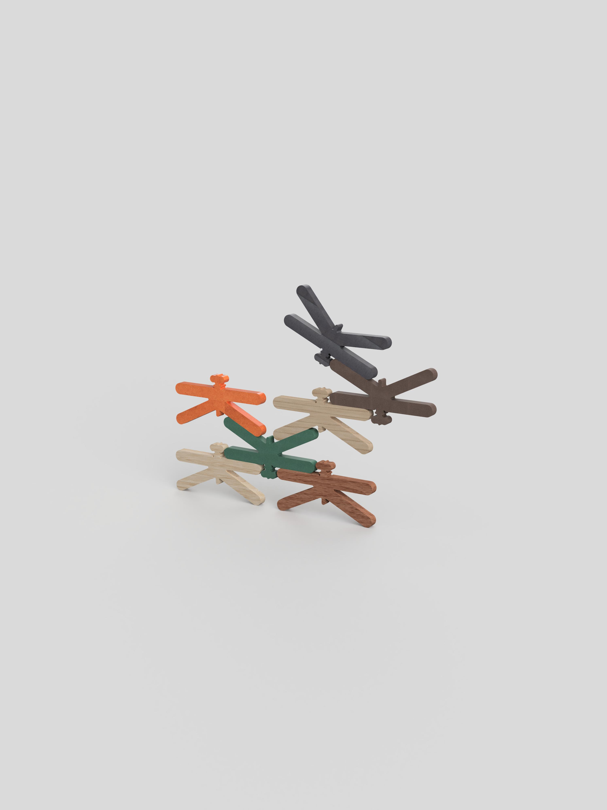

# Libi

<!--
  HERO: idealmente uma pseudo-sessão fotográfica do produto
  (ver tutorial Pletor.ai nos Recursos da disciplina, em
  /Recursos/AI_exps/). Usa attachments/hero.jpg para o frontmatter.
-->

> Um sistema de libelinhas monobloco paramétricas que desafia a atenção e a concentração através do equilíbrio gravítico passivo e de livre recombinação. 

## Conceito

**O que é?**

Libi, um brinquedo modular de empilhamento vertical e horizontal, fabricado através de corte CNC a partir do reaproveitamento de excedentes industriais de madeira. O seu design dispensa propositadamente de encaixes mecânicos fixos e complicados, dependendo do atrito superficial e do cálculo empírico do centro de massa por parte da criança ou de qualquer outro utilizador. (E claro, do empenho, cuidado e foco que o mesmo dá a brincadeira!) 

**Para quem?**

Libi tem como publico-alvo crianças com idade escolar (a partir dos 5 anos) e todos os jovens e adultos interessados num objeto potencialmente anti-stress e/ou que ajude a trabalhar a concentração.

**Porquê?**

- Responde diretamente à pegada ecológica da indústria do mobiliário, a sua forma única (monobloco) e pequena ajuda a otimizar ainda mais o desperdício em placas já usadas;
- Contraria os estímulos rápidos digitais através de uma experiência mais tátil, onde o erro faz parte do processo de aprendizagem e o sucesso exige desaceleração e controlo motor;
- Mostra que a geometria orgânica inspirada na natureza pode gerar estabilidade estrutural complexa através de regras físicas simples.

## Enquadramento

Posicionamento em relação ao contexto de grupo (ver [contexto](../../contexto.md)) e à recolha de objetos a redesenhar.

## Tecnologia

Materiais (espécie de madeira), processos de fabrico (CNC, laser, impressão 3D), software paramétrico, ficheiros técnicos.

- Modelo 3D: <!-- embed Fusion ou link a360.co -->
- Ficheiros: `attachments/`

## Função

**Como se brinca?**

É um brinquedo de exploração livre e intuitiva. O utilizador é convidado a empilhar as libelinhas sequencialmente, experimentando diferentes posições, rotações e pontos de apoio. Como o design abdica de encaixes mecânicos, o desafio consiste em encontrar o centro de gravidade de cada peça à medida que a estrutura cresce.

A atividade pode ser explorada de duas formas, individualmente ou em grupo, podendo-se tornar num jogo onde cada jogador adiciona uma peça à vez na estrutura partilhada. O objetivo é manter o conjunto estável, perdendo quem colocar a libelinha que cause a queda da estrutura.

**Idade-Alvo**

Classificação etária recomendada: A partir dos 5 anos(5+).

Embora o design não apresente perigo de asfixia, o brinquedo exige um nível de coordenação motora, controlo da pressão palmar e paciência que só se desenvolvem plenamente a partir desta idade. Adicionalmente, o conceito de tentativa-erro associado à física elementar é melhor aproveitado por crianças em idade escolar. 

**Montagem**

Dificuldade: Nenhuma (sem montagem prévia).

Especificações: O produto é classificado como monobloco pronto a brincar. Não requer ferramentas, encaixes e instruções complexas. A "montagem" é a própria essência lúdica do brinquedo, sendo feita e desfeita infinitamente pelo utilizador. 

Conformidade com a Diretiva 2009/48/CE

Para garantir que o projeto é viável no mercado europeu, o design cumpre os requisitos essenciais da diretiva:

Propriedades Mecânicas e Físicas (Artigo 10.º)

- As libelinhas têm dimensões superiores aos calibradores de asfixia padrão (peças com 13 cm de comprimento), eliminando o risco de ingestão.
- O corte CNC prevê a aplicação de raios de curvatura (fillets) em todas as arestas e pontas da libelinha, garantindo a ausência de cantos afiados ou rebarbas que possam perfurar ou cortar a pele.

Inflamabilidade: A madeira maciça ou derivados de alta densidade (como o contraplacado ou o MDF hidrófugo do protótipo) apresentam uma velocidade de propagação de chama lenta, cumprindo os critérios de não-inflamabilidade imediata.

Propriedades Químicas (Anexo II, Parte III): Como o brinquedo aproveita excedentes industriais, o projeto especifica que as peças finais devem ser limpas de resíduos tóxicos e acabadas apenas com óleos vegetais naturais ou ceras de abelha com certificação EN 71-3 (isenção de metais pesados e formaldeídos), tornando o brinquedo seguro mesmo em caso de contacto bocal esporádico. 

## Apresentação

---

## Processo

O percurso completo de iterações, modelos e pesquisa está em [processo.md](produtos/_modelo/processo.md), organizado do **mais recente** para o **mais antigo**.

[Ver processo completo →](produtos/_modelo/processo.md)
