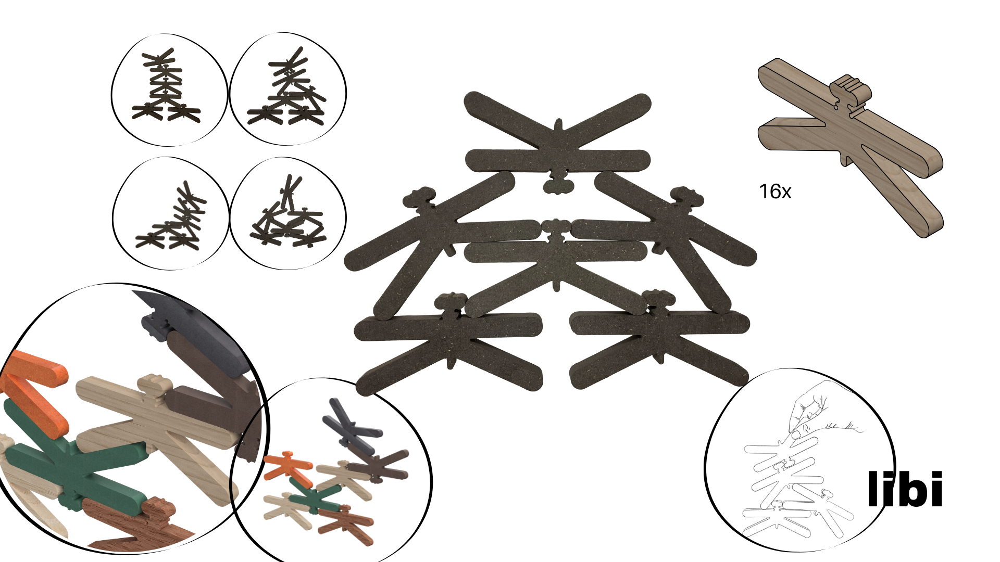

# Libi

> Gravidade em ciclo. 

## Conceito

**O que é?**

Libi, um brinquedo modular de empilhamento com um **sistema de encaixe gravítico passivo** vertical e horizontal, fabricado através de corte CNC a partir do reaproveitamento de excedentes industriais de madeira. O seu design **dispensa propositadamente de encaixes mecânicos fixos e complicados**, dependendo do atrito superficial e do cálculo empírico do centro de massa por parte da criança ou de qualquer outro utilizador. (E claro, do empenho, cuidado e foco que o mesmo dá a brincadeira!) 

**Para quem?**

Libi tem como publico-alvo crianças com idade escolar (a partir dos 5 anos) e todos os jovens e adultos interessados num objeto potencialmente anti-stress e/ou que ajude a trabalhar a concentração.

**Porquê?**

- Responde diretamente à pegada ecológica da indústria do mobiliário, a sua forma única (monobloco) e pequena ajuda a otimizar ainda mais o desperdício em placas já usadas;
- Contraria os estímulos rápidos digitais através de uma experiência mais tátil, onde o erro faz parte do processo de aprendizagem e o sucesso exige desaceleração e controlo motor;
- Mostra que a geometria orgânica inspirada na natureza pode gerar estabilidade estrutural complexa através de regras físicas simples.

Prancha-resumo do projeto Libi.

## Enquadramento

O brinquedo Libi é a tradução perfeita da ideia central do  grupo, de que na natureza o conceito de lixo não existe e tudo se transforma. Ao olhar para a exigência da proposta Nestor de usar apenas madeira, decidiu-se não criar algo do zero, mas sim dar uma nova vida ao que já tinha sido descartado. É aqui que o conceito da Libi se cruza com o ciclo natural, pois o brinquedo nasce do reaproveitamento de excedentes e restos da indústria de mobiliário. 

Esta ligação ao funcionamento da natureza também se reflete na mecânica do brinquedo,  Libi leva o principio do "0 encaixes" ao limite ao funcionar apenas através da gravidade e do atrito. Ao usar uma forma inspirada no meio ambiente para encontrar estabilidade através de regras físicas simples, o brinquedo mostra que a própria natureza já nos dá as soluções estruturais de que precisamos. Não há truques mecânicos ou artificiais, é apenas a física real do Universo a ditar as regras do brinquedo.

Por fim, o objetivo pedagógico do grupo, que passa por afastar as crianças dos estímulos virtuais rápidos e trazê-las de volta ao mundo real, ganha forma na dinâmica da Libi. O ato de empilhar as peças sem encaixes fixos exige desaceleração, foco e paciência, transformando o erro numa parte natural da aprendizagem, exatamente como acontece no desenvolvimento de qualquer ser vivo. Quer a brincadeira seja feita de forma individual ou partilhada em grupo, a Libi deixa de ser apenas um objeto isolado e passa a ser a prova viva do nosso manifesto coletivo, um design que respeita, ouve e honra o ciclo o ecossistema.

## Tecnologia

O design modular do Libi foi desenvolvido no **AutoDesk Fusion 360** para maquinação **CNC**, sendo geometricamente otimizado para o corte com uma **fresa de 3 mm**. Esta engenharia de precisão garante encaixes com tolerâncias milimétricas, permitindo que o sistema funcione por fricção perfeita em placas de qualquer madeira com **espessuras variáveis dos 12 aos 20 mm**. É a tecnologia digital aplicada diretamente à sustentabilidade. 

- Modelo 3D: https://a360.co/4xRilnh

## Função

**Como se brinca?**

É um brinquedo de **exploração livre e intuitiva**. O utilizador é convidado a **empilhar as libelinhas** sequencialmente, **experimentando** diferentes posições, rotações e pontos de apoio. Como o design abdica de encaixes mecânicos, o desafio consiste em encontrar o centro de gravidade de cada peça à medida que a estrutura cresce.

A atividade pode ser explorada de duas formas, **individualmente ou em grupo**, podendo-se tornar num jogo onde cada jogador adiciona uma peça à vez na estrutura partilhada. O objetivo é manter o conjunto estável, perdendo quem colocar a libelinha que cause a queda da estrutura.

**Idade-Alvo**

Classificação etária recomendada: A partir dos 5 anos **(5+)**.

Embora o design não apresente perigo de asfixia, o brinquedo exige um nível de coordenação motora, controlo da pressão palmar e paciência que só se desenvolvem plenamente a partir desta idade. Adicionalmente, o conceito de tentativa-erro associado à física elementar é melhor aproveitado por crianças em idade escolar. 

**Montagem**

Dificuldade: Nenhuma (sem montagem prévia).

Especificações: O produto é classificado como monobloco pronto a brincar. Não requer ferramentas, encaixes e instruções complexas. A "montagem" é a própria essência lúdica do brinquedo, sendo feita e desfeita infinitamente pelo utilizador. 

**Conformidade com a Diretiva 2009/48/CE**

Para garantir que o projeto é viável no mercado europeu, o design cumpre os requisitos essenciais da diretiva:

**Propriedades Mecânicas e Físicas (Artigo 10.º)**

- As libelinhas têm dimensões superiores aos calibradores de asfixia padrão (peças com 13 cm de comprimento), eliminando o risco de ingestão.
- O corte CNC prevê a aplicação de raios de curvatura (fillets) em todas as arestas e pontas da libelinha, garantindo a ausência de cantos afiados ou rebarbas que possam perfurar ou cortar a pele.

**Inflamabilidade**: A madeira maciça ou derivados de alta densidade (como o contraplacado ou o MDF hidrófugo do protótipo) apresentam uma velocidade de propagação de chama lenta, cumprindo os critérios de não-inflamabilidade imediata.

**Propriedades Químicas (Anexo II, Parte III)**: Como o brinquedo aproveita excedentes industriais, o projeto especifica que as peças finais devem ser limpas de resíduos tóxicos e acabadas apenas com óleos vegetais naturais ou ceras de abelha com certificação EN 71-3 (isenção de metais pesados e formaldeídos), tornando o brinquedo seguro mesmo em caso de contacto bocal esporádico. 

## Apresentação

Imagem gerada pelo Gemini.google (Render a baixo utilizado)

Render no Auto Desk Fusion 360

---

## Processo

O percurso completo de iterações, modelos e pesquisa está em [processo.md](produtos/2024268_karina_aguilar/processo.md), organizado do **mais recente** para o **mais antigo**.

[Ver processo completo →](produtos/2024268_karina_aguilar/processo.md)
