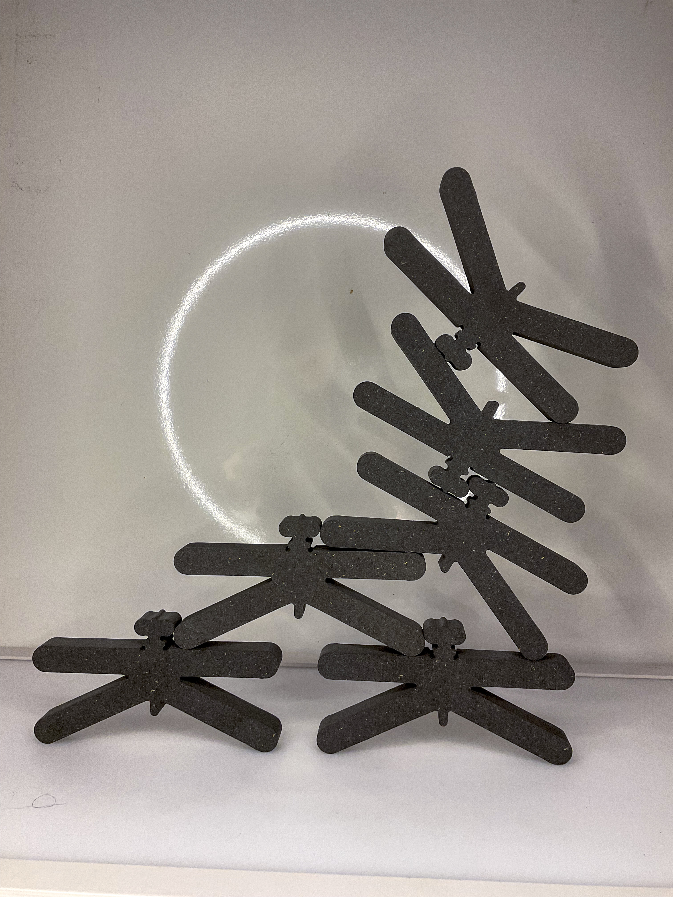
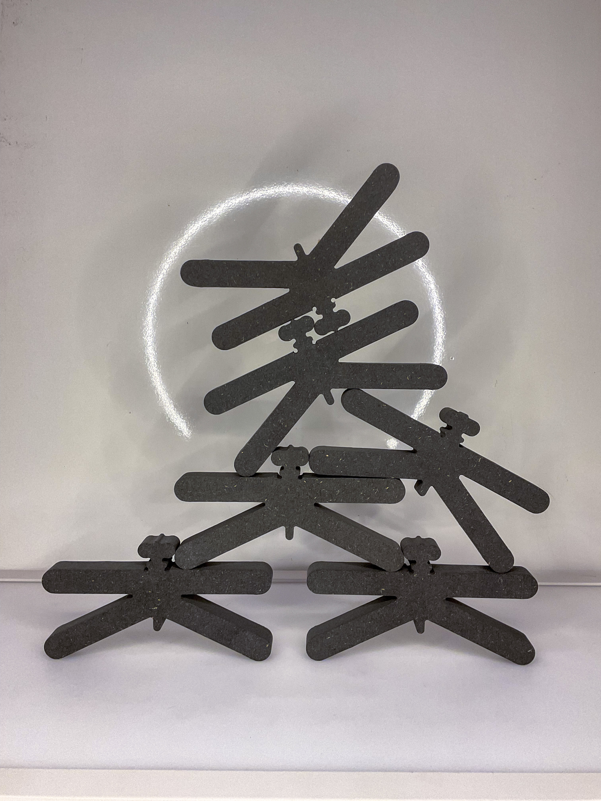
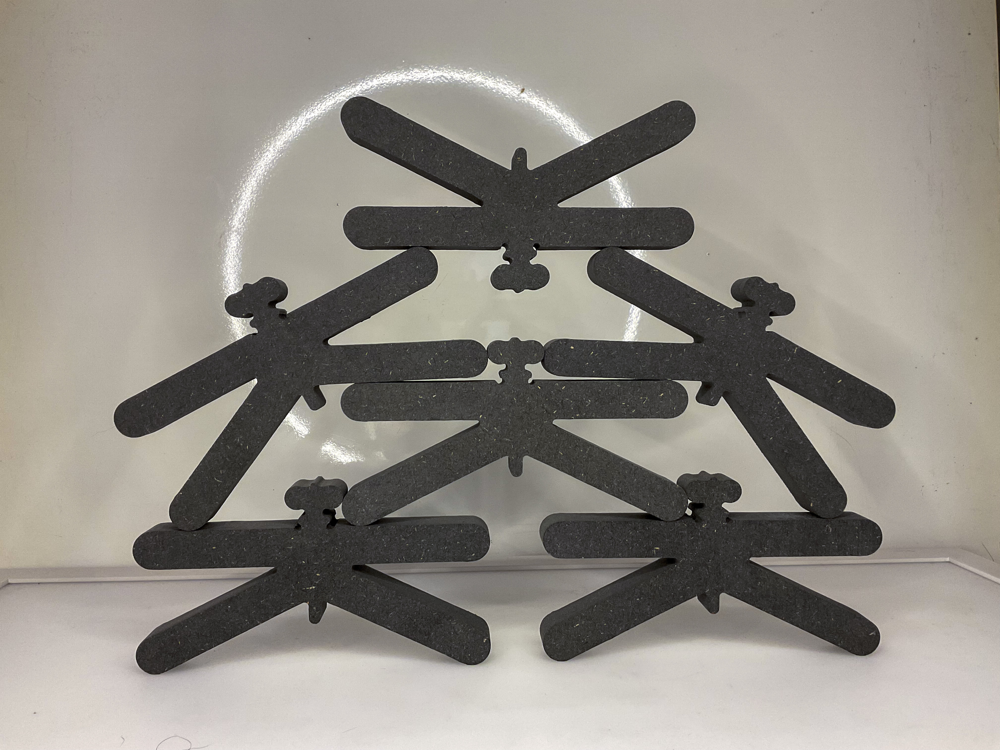
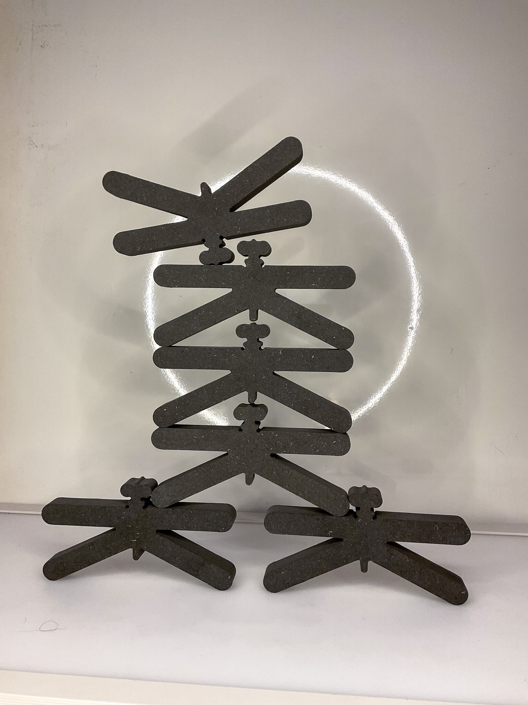
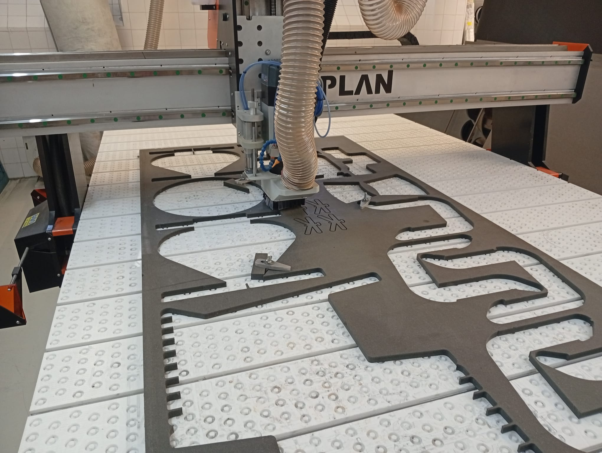
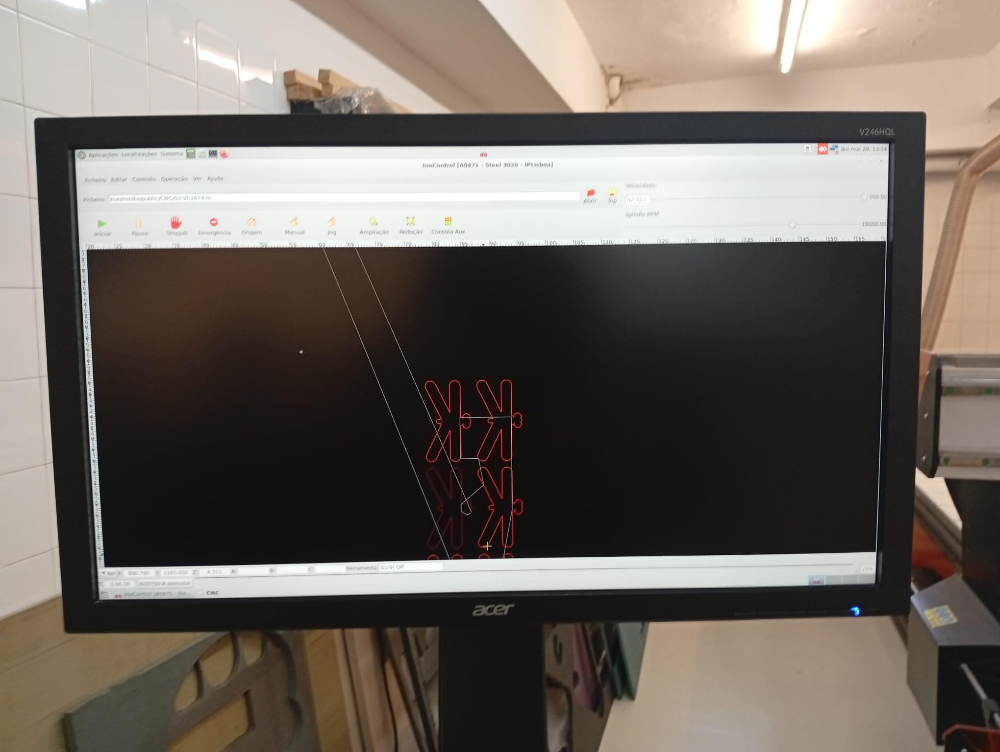
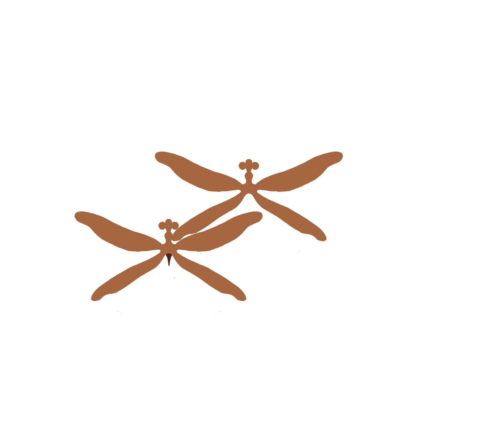
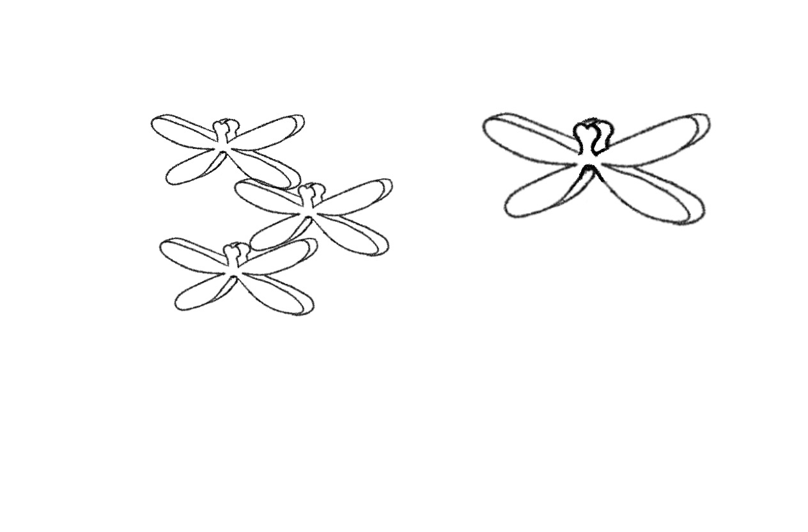
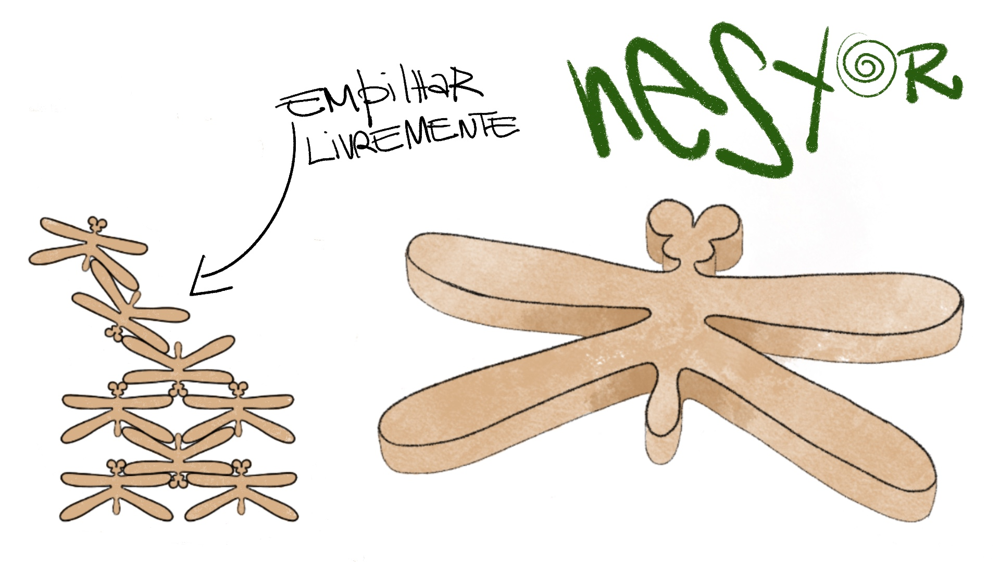
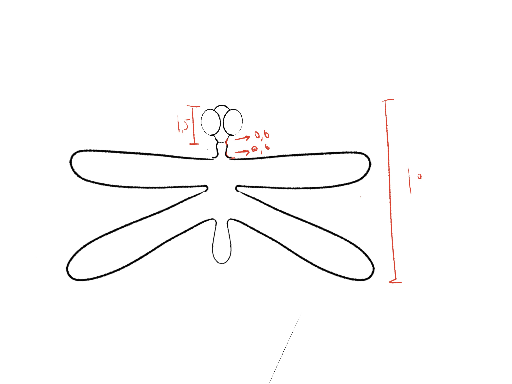

# Processo

> 

## 1. Protótipo(s)

Para validar a geometria do brinquedo e a eficácia dos encaixes modulares, foram produzidos protótipos físicos com 15mm de espessura em MDF colorido em massa (Valchromat), recorrendo ao corte da CNC. Esta fase foi importante para **testar e explorar o equilíbrio e os pontos de unificação** das libelinhas. Para além disso, ajudou na descoberta que o dinamismo da brincadeira com a Libi vai para além da sua projeção inicial, **revelando pontos de equilibrio e "encaixe"** que não tinham ainda sido pensados na mesma. 

## 2. Processo de Prototipagem

**Maquinação CNC e Economia de Recursos**

O processo de fabrico dos protótipos assentou numa **lógica de desperdício zero** e aproveitamento de recursos existentes na oficina. Em vez de se sacrificar uma placa de material nova, utilizou-se uma sobra de uma tábua de grandes dimensões em Valchromat. Através de da estratégia de **_nesting_** planeada primeiro no Fusion e depois na máquina, conseguiu-se agrupar e otimizar o corte de **6 peças** do brinquedo Libi utilizando apenas uma área reduzida de **70 x 20 cm** dessa tábua. 

A maquinação foi executada numa **fresadora CNC de três eixos** (OUPLAN). Para garantir a precisão milimétrica dos encaixes e a definição do contorno orgânico em forma de libelinha, utilizou-se uma fresa de topo plano de **3 mm**. Esta escolha permitiu obter cantos internos limpos e mais perfeitos e reduzir a perda de material por canal de corte, assegurando que o sistema modular funcionasse com a fricção ideal.

**Acabamentos Pontuais**

**Lixagem de arestas**: Executada com lixa de grão fino para suavizar os cantos tornando as peças agradáveis ao toque e seguras para a manipulação infantil.

**Limpeza e retificação**: Verificação e limpeza dos canais de encaixe para remover qualquer resíduo de pó de madeira que pudesse comprometer a estabilidade do empilhamento.

## 4. Modelos 3D

Assim que as dimensões estavam minimamente decididas seguiu-se para a realização de um **modelo 3D do Libi no Fusion**. A partir daí e desse primeiro documento 3d foi se sempre **aperfeiçoando e limpado mais o desenho paramétrico** para depois no **_nesting_** correr tudo bem. É importante referir também que durante a realização dos modelos foi recorrido o desenho à mão com pequenos esboços de encaixes e detalhes.

https://a360.co/4oymUOS

1º Modelo 3D

https://a360.co/4eE7lkm

2ª Modelo 3D

https://a360.co/4xRilnh

3ª Modelo 3D - Final 

https://a360.co/4exBf9C

4ª Modelo - Usado para renders 

## 5. Esboços e Pranchas-Resumo

Nesta fase ainda muito inicial houve uma exploração de possíveis formas (todas dentro duma forma já estipulada devido às necessidades do brinquedo) em desenho manual e digital. Quando o brinquedo já estava visualmente conseguido deu-se à realização de uma prancha-resumo inicial para a apresentação do projeto ao docente. 

Esboço 1 - Exploração de formas

Esboço 2 - Exploração de formas

.jpg)

Esboço 3 - Exploração de formas

.jpg)

Esboço 4 - Exploração de formas (Forma 1)

.jpg)

Esboço 5 - Aperfeiçoamento de forma 1

Esboço 6 - Teste de funcionamento forma 1

%201.jpg)

Esboço 7 - Forma 1 com volumetria

Esboço 8 - Prancha-resumo 1

%201.jpg)

Esboço 9 - Exploração nova de formas 

.jpg)

Esboço 10 - Continuação da exploração (Forma 2)

.jpg)

Esboço 11 - Continuação da exploração (Forma 2)

Esboço 12 - Aperfeiçoamento da forma 2

.jpg)

Esboço 13 - Aperfeiçoamento da forma 2

.jpg)

Esboço 14 - Aperfeiçoamento da forma 2

.jpg)

Esboço 15 - Exploração de ângulos de corte 

## 6. Pesquisa

### 6.1. Aspectos valorizados do moodboard, desconstrução da forma (o que distingue o programa formal)

Foi valorizado um desenho mais orgânico 

### 6.2. Objetos de referência

Inventário de precedentes, brinquedos análogos, referências históricas.

## 7. Outros Elementos

Outros materiais relevantes para a preparação do conceito (entrevistas, observação, testes com utilizadores, notas, leituras, inspirações).
