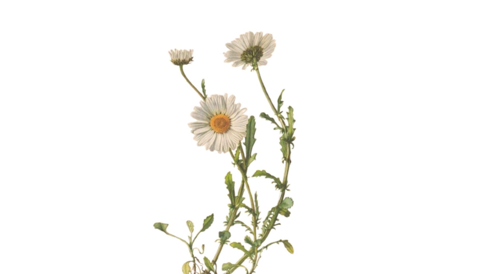

# Quil

> Equilíbrio através na Natureza. 

## Conceito

**O que é?**

Esta prancha de equilíbrio é um objeto composto por apenas três peças de madeira que se encaixam sem precisar de qualquer prego, parafuso ou cola. O brinquedo é formado por uma plataforma superior com uma silhueta floral e duas peças curvas inferiores que se cruzam para criar o ponto de balanço. Desenhada para o fabrico digital em CNC, a prancha aproveita ao máximo a precisão dos encaixes puros por fricção, resultando num produto funcional e fácil de montar e desmontar.

**Para quem?**

O projeto foi pensado para crianças em idade escolar (a partir dos 5 anos), faixa etária em que estão a desenvolver a sua coordenação e agilidade, mas estende-se também a jovens e adultos. É o brinquedo ideal para quem precisa de trabalhar o foco, a postura e a concentração através do corpo, servindo tanto para momentos de exploração individual e livre como para dinâmicas de grupo divertidas.

**Porquê?**

A prancha responde diretamente aos valores de sustentabilidade da proposta Nestor e ao conceito de ciclo natural que guia o nosso grupo. Em primeiro lugar, o seu design plano e modular foi planeado para aproveitar de forma inteligente os excedentes de placas de madeira da indústria de mobiliário, reduzindo o desperdício. Em segundo lugar, a sua forma orgânica, inspirada nas geometrias de uma flor e ao mesmo tempo o Sol traz a biofilia para o campo do movimento físico.

## Enquadramento

No ambiente natural, o desperdício não existe, e este brinquedo segue exatamente essa regra ao ser planeado para reaproveitar os restos de placas de madeira da indústria de mobiliário. Em vez de criarmos mais lixo, damos uma nova vida a essa matéria-prima, garantindo que o ciclo de vida do material se prolonga de forma sustentável, tal como a proposta Nestor exige.

Esta ligação à Natureza também se vê na forma do objeto. Deixámos que o mundo natural fosse o designer, escolhendo a **geometria de uma flor e do Sol** para dar forma à plataforma.É a engenharia mecânica da própria natureza aplicada ao design, as formas curvas da base cruzam-se para criar o ponto de balanço apenas com o encaixe  da madeira.

A prancha responde ao nosso objetivo pedagógico de afastar as crianças dos ecrãs digitais e trazê-las de volta ao **mundo real**. Ao subir para a prancha, o utilizador é obrigado a esquecer os estímulos rápidos e virtuais para se focar no próprio corpo. O desafio de se manter equilibrado exige paciência, controlo motor e uma resposta imediata à gravidade e ao peso. Ao tentar equilibrar-se, a criança descobre as leis físicas de forma intuitiva e livre.

## Tecnologia

Todo o modelo foi desenvolvido no **Autodesk Fusion 360** e pensado para ser fabricado com corte **CNC**. 

Em relação aos materiais, o design foi pensado para ser flexível e inteligente. A prancha pode ser fabricada a partir de **qualquer espécie de madeira com 20 mm de espessura**, desde que seja uma madeira  resistente o suficiente para aguentar o peso de uma criança ou de um adulto (ex: contraplacado de bétula, o pinho ou o carvalho). Esta liberdade na escolha da madeira espelha muito bem o objetivo do projeto Nestor, já que o software industrial pode aproveitar qualquer sobra de placa com essa espessura que esteja disponível na fábrica.

- Modelo 3D: https://a360.co/4uLI2CP

## Função

**Como se brinca?**

A brincadeira com a prancha é totalmente livre e intuitiva. O utilizador só tem de subir para a plataforma e tentar manter-se direito, distribuindo o peso para balançar o corpo de um lado para o outro ou para a frente e para trás. À medida que se ganha confiança, o desafio pode ser dificultado tentando equilibrar-se apenas num pé, fazendo agachamentos ou fechando os olhos. Além do uso individual, pode transformar-se num jogo de grupo muito divertido, onde os amigos cronometram o tempo para ver quem consegue aguentar mais tempo em equilíbrio.

**Idade-Alvo**

A classificação etária recomendada é a partir dos 5 anos (5+). Embora as peças sejam grandes e não apresentem risco de asfixia por ingestão, o brinquedo exige coordenação motora, controlo das pernas e uma noção de equilíbrio que as crianças mais pequenas ainda estão a desenvolver. 

**Montagem**

A montagem é super rápida e simples. O produto é composto por apenas três peças que se guardam e transportam facilmente em formato plano. Não são necessárias ferramentas, parafusos ou instruções difíceis, para montar basta cruzar as duas peças curvas que formam o pé de balanço e, em seguida, encaixar a plataforma floral por cima através das ranhuras de pressão. O próprio peso do utilizador e o atrito natural da madeira travam o conjunto, deixando a prancha estável e pronta a usar em poucos segundos. 

**Conformidade com a Diretiva 2009/48/CE**

O design da prancha foi planeado respeitando as normas europeias de segurança de brinquedos. No plano físico e mecânico, a utilização de placas de madeira com 20 mm de espessura garante a resistência e a estabilidade necessárias para suportar o peso do corpo sem risco de quebras ou falhas estruturais. O corte milimétrico em CNC assegura que todos os contornos da flor e da base fiquem perfeitamente lisos e arredondados, eliminando arestas cortantes que possam magoar. Além disso, a nível de toxicidade de materiais, o brinquedo celebra a madeira na sua essência mais pura e limpa, livre de colas químicas e acabamentos tóxicos, garantindo uma manutenção simples e um manuseamento totalmente seguro para a saúde das crianças e dos adultos.

## Apresentação

---

## Processo

O percurso completo de iterações, modelos e pesquisa está em [processo.md](produtos/2024572_sebastião_abreu/processo.md), organizado do **mais recente** para o **mais antigo**.

[Ver processo completo →](produtos/2024572_sebastião_abreu/processo.md)
