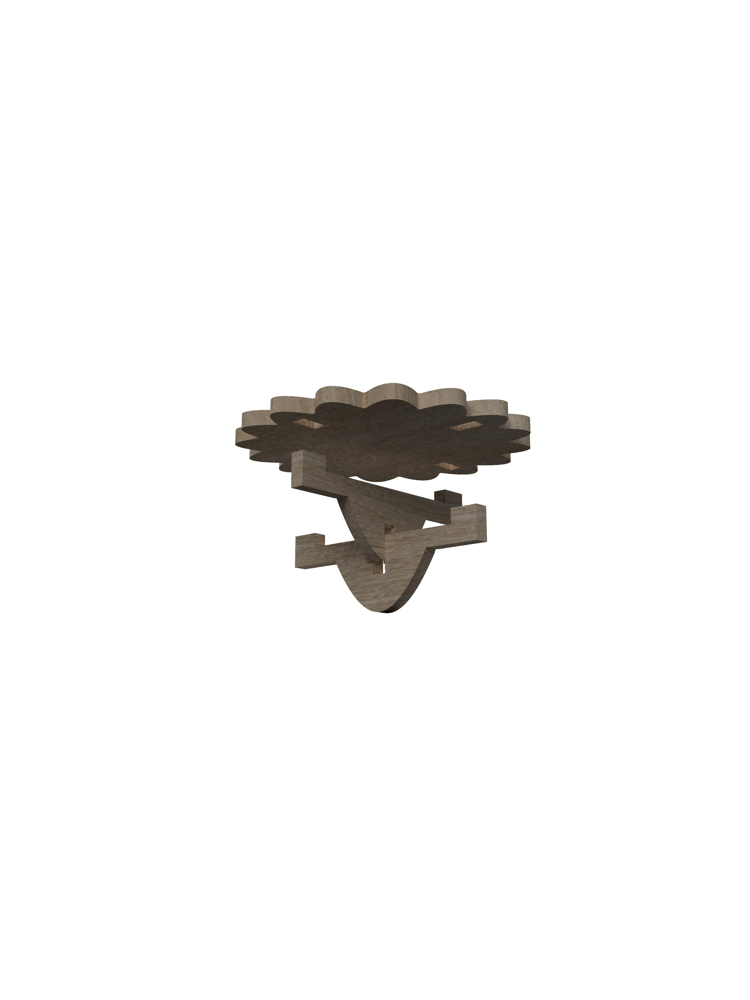
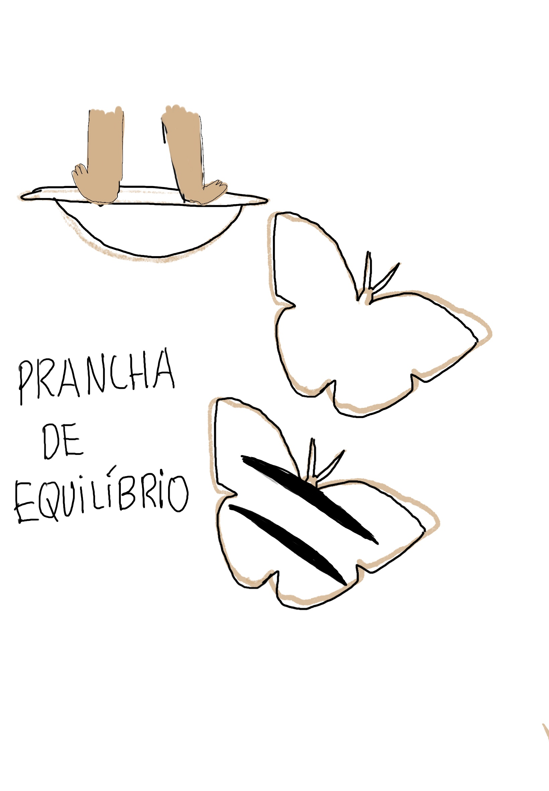

# Processo

## 1. Renders

Render Quill - **AutoDesk Fusion 360**

## 2. Modelos 3D

Foram realizados mais que um modelo no Fusion para o aperfeiçoamento do desenho paramétrico.

https://a360.co/4uLI2CP

Modelo 3D Final

https://a360.co/3Qq6Mm2

1º Modelo 3D 

## 3. Esboços e Pranchas-Resumo

1º Prancha-resumo 

## 4. Pesquisa

### 4.1. Aspectos valorizados do moodboard, desconstrução da forma (o que distingue o programa formal)

Para além da inspiração em motivos florais mais especificamente na famosa flor _Malmequer_ (presente no Moodboard geral do projeto) foi usada uma forma mais imaginativa e orgânica do Sol, muito ligada e presente nos desenhos animados e ilustrações para crianças. 

### 4.2. Objetos de referencia

https://www.adapt4you.com/product-page/prancha-de-equilibrio

